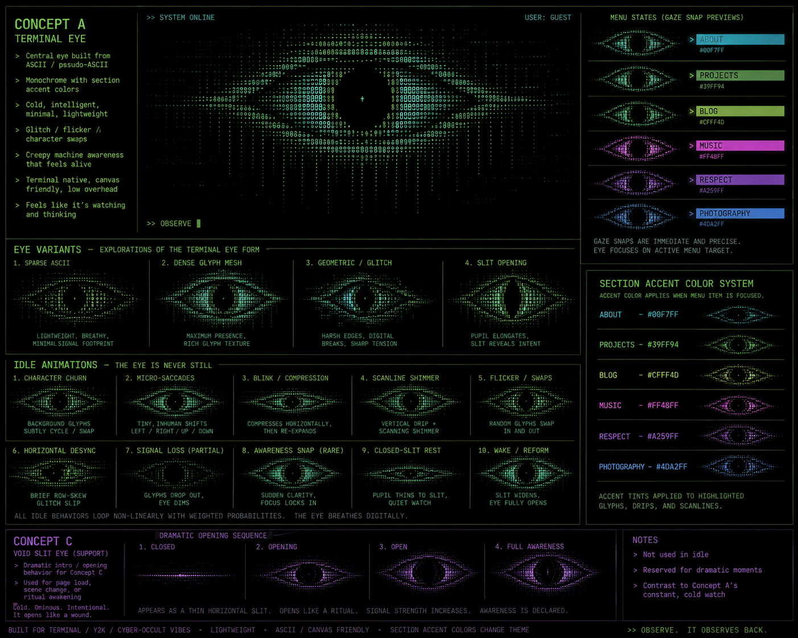

# AsciiEye

A personal landing page that behaves like a console noticing you.

There is no hero copy, no tagline, no “SYSTEM ONLINE”. The viewport is a
near-black field. In the middle sits a large glyph eye assembled from `. : | - +
< > 0 1`. Around it, six section links orbit irregularly. Hover a link and the
eye snaps its gaze toward that node. Click, and the interface collapses into
the pupil before the destination page loads.

This is v1 of a personal site. Destination routes are placeholders (`THIS IS
LIVE`). The landing page is the product.



---

## Quick start / stop

From the repo root:

```bash
./run          # start (also: ./run start)
./run stop     # stop
./run restart
./run status
./run logs     # follow the dev log; Ctrl-C detaches, server keeps running
```

Same thing via npm:

```bash
npm run up
npm run down
npm run status
npm run logs
```

The runner installs dependencies if `node_modules` is missing, writes a pid
file under `.run/`, and prints the local URL when the server is ready. Default
port is `3000`. Override with `PORT=3001 ./run start`.

Requirements: **Node.js 22.13+** and npm. `gh` is already authenticated over
SSH on this machine if you are publishing.

---

## What every file is for

If you open the tree and cannot tell signal from leftover scaffold, use this
map. After cleanup, almost everything here is used.

```
AsciiEye/
├── run                      Start/stop/status/logs for the local server
├── package.json             Scripts + runtime deps (React, vinext)
├── package-lock.json        Locked install
├── tsconfig.json            TypeScript paths (`@/*` → repo root)
├── next.config.ts           Empty Next config; vinext still reads it
├── vite.config.ts           Dev/build pipeline: vinext + Cloudflare + Sites plugin
├── .gitignore
├── .oxlintrc.json           oxlint (npm run lint)
├── .oxfmtrc.json            oxfmt (npm run format)
├── .openai/hosting.json     Sites-scaffold hosting ids (d1/r2 unused)
│
├── app/                     The actual website
│   ├── layout.tsx           Root HTML, metadata, global CSS import
│   ├── page.tsx             Landing page: state machine, nav, idle, transitions
│   ├── globals.css          All visual language (eye, orbit, boot, swallow)
│   ├── live-page.tsx        Shared placeholder body for destination routes
│   ├── eye/
│   │   ├── Eye.tsx          Presentational glyph eye (rows + iris overlay + drips)
│   │   └── raster.ts        Almond rasterizer, gaze clamp, mutations
│   ├── about/page.tsx       /about
│   ├── projects/page.tsx    /projects
│   ├── blog/page.tsx        /blog
│   ├── music/page.tsx       /music
│   ├── greetings/page.tsx   /greetings
│   └── photography/page.tsx /photography
│
├── public/
│   ├── favicon.svg          Tab icon
│   └── og.png               Open Graph image
│
└── docs/
    ├── design-brief.md      Original v1 spec (the prompt this was built from)
    └── ASCIIEYE-DESIGN.png  Visual concept for the terminal eye
```

### Runtime source (read these first)

| File | Role |
| --- | --- |
| `app/page.tsx` | Client landing page. Owns the UI state machine, section table, hover/tap/keyboard input, gaze snaps, idle event scheduler, and the collapse-into-pupil navigation transition. |
| `app/eye/raster.ts` | Pure functions. Builds a 97×21 glyph mesh that looks like an almond eye, clamps the pupil so it stays inside the lids, and applies one-off glyph mutations for idle glitches. |
| `app/eye/Eye.tsx` | Dumb renderer. Takes `rows` / `irisRows` / `desyncRows` and paints two stacked `<pre>` layers plus hanging drip fragments. |
| `app/globals.css` | Atmosphere. Background grain, orbital link positions, boot sequence, idle transforms, swallow transition, reduced-motion overrides, mobile layout. CSS variables are the live visual state. |
| `app/layout.tsx` | Document shell and metadata. Set `NEXT_PUBLIC_SITE_URL` when you have a public origin; it defaults to `http://localhost:3000`. |
| `app/live-page.tsx` | One-line placeholder used by every destination route so those pages stay in sync. |

### Destination stubs

`about`, `projects`, `blog`, `music`, `greetings`, `photography` are real
routes with semantic links from the landing page. They currently render
`THIS IS LIVE` and nothing else. That is intentional: v1 does not style
section pages.

### Tooling you rarely touch

| File | Role |
| --- | --- |
| `vite.config.ts` | Wires vinext (Next-on-Vite), the Cloudflare Vite plugin, and the leftover OpenAI Sites plugin so local `vinext dev` still boots. |
| `.openai/hosting.json` | Project ids from the Sites scaffold. `d1` and `r2` are null; the file exists because `vite.config.ts` imports it. |
| `next.config.ts` | Present because vinext is a Next API surface. Empty on purpose. |
| `run` | The only command you need day to day. |

### What was deleted, and why

The repo started as an OpenAI Sites / vinext / shadcn scaffold. None of that
UI kit was used by the landing page, so it is gone:

- `components/ui/*` (~60 shadcn primitives)
- `components.json`, `hooks/use-mobile.ts`, `lib/utils.ts`
- unused packages: lucide, recharts, cmdk, date-fns, Base UI, Tailwind, etc.

If you later want a component library, add it back on purpose rather than
inheriting 60 unused files.

Generated / local-only (gitignored): `node_modules/`, `.next/`, `.vinext/`,
`dist/`, `.wrangler/`, `.run/`, `*.tsbuildinfo`.

---

## How the landing page works

### State machine

`app/page.tsx` keeps a single interface state:

| State | Meaning |
| --- | --- |
| `BOOTING` | Opening animation (~1–1.3s). Menu links exist in the DOM the whole time. |
| `IDLE` | Nothing selected. Eye looks forward. Rare idle glitches may fire. |
| `FOCUSED` | Desktop hover or keyboard focus on a nav item. Eye has snapped to that node. |
| `ARMED` | Mobile first tap. Same visual as focused, plus “TAP AGAIN”. |
| `TRANSITIONING` | Navigation committed. Input ignored. Pupil dilates, field collapses, then `location.assign`. |

Conflicting events are dropped while `TRANSITIONING` (a `locked` ref).

### The eye does not chase the cursor

Gaze targets are discrete. Each section stores a `{ x, y }` in
approximately `[-1, 1]`. Hover/focus/tap picks a section; the pupil eases
to that target in ~140ms with a tiny overshoot. Raw mouse tracking is
deliberately not implemented.

### Raster

`rasterEye()` walks a 97-column × 21-row grid, tests an almond outline, and
picks glyphs by density:

- lid / edge → `: | - + < > 1`
- iris ring around the pupil → `0 1 | : +`
- field → `. : | - + < > 0 1`

The pupil is a hole (spaces). An iris overlay layer is the same mesh with
non-iris cells blanked, so the accent color can tint only the ring when a
section is active.

Idle events mutate cells after raster: character churn, flicker-to-space,
row desync, micro-saccades, compression, partial signal loss, slit, reform,
and a rare direct stare.

### CSS variables (tune look without rewriting JS)

Set on the landing `<main>` from React:

| Variable | Meaning |
| --- | --- |
| `--background` | Near-black page ground |
| `--eye-default` | Idle off-gold (`#C9B77A`) |
| `--active-accent` | Current section color, or the default gold |
| `--eye-x` / `--eye-y` | Current gaze |
| `--eye-open` | Boot lid |
| `--glitch-strength` | Desync magnitude |
| `--glow-strength` | Eye drop-shadow |
| `--pull-x` / `--pull-y` | Swallow-transition streak direction |

### Section accents

| Section | Color | Route |
| --- | --- | --- |
| ABOUT | `#00F7FF` | `/about` |
| PROJECTS | `#39FF94` | `/projects` |
| BLOG | `#CFFF4D` | `/blog` |
| MUSIC | `#FF48FF` | `/music` |
| GREETINGS | `#A259FF` | `/greetings` |
| PHOTOGRAPHY | `#4DA2FF` | `/photography` |

Accents recolor the active link, the iris overlay, and a little glow. They
do not flood the whole screen.

### Interaction

**Desktop** — hover previews (color + gaze snap). Click enters.

**Mobile** — first tap selects and arms. Second tap on the same item
navigates. Tapping a different item switches selection.

**Keyboard** — Tab moves between real `<a>` links. Focus is treated like
hover. Enter commits the swallow transition. `:focus-visible` is styled,
not removed.

**Reduced motion** — `prefers-reduced-motion: reduce` strips boot, idle
glitches, overshoot, and the collapse animation. Navigation is almost
immediate. Colors and gaze targets still update.

**No JavaScript** — links still work. The user sees a static eye and a
usable menu. Double-tap-to-arm is enhancement only.

### Boot and swallow

Boot (~1s): black → faint line → split → glyphs reconstruct → menu fades
in → idle.

Navigation (~600–900ms): lock input → other links vanish → gaze snap →
pupil dilates → field pulls into the pupil → black → `window.location.assign`.

Returning via back/pageshow resets to `IDLE` instead of leaving a stuck
blackout.

---

## Scripts

| Command | What it does |
| --- | --- |
| `./run start` / `npm run up` | Background dev server |
| `./run stop` / `npm run down` | Kill the dev server |
| `npm run dev` | Foreground vinext dev (same server, stays in the terminal) |
| `npm run build` | Production build to `dist/` |
| `npm start` | Serve the production build via wrangler (needs `npm run build` first) |
| `npm run lint` | oxlint |
| `npm run format` | oxfmt |

---

## Stack

This is a **vinext** app: Next.js App Router APIs running on **Vite**,
previewed as a **Cloudflare Worker** through Wrangler.

| Piece | Why it is here |
| --- | --- |
| React 19 + App Router | `app/` routes, metadata, client landing page |
| vinext | `vinext dev` / `vinext build` instead of `next` |
| Vite + `@cloudflare/vite-plugin` | Local worker-shaped preview |
| `@openai/sites-vite-plugin` | Leftover from the Sites scaffold; still required by `vite.config.ts` |
| IBM Plex Mono | Loaded from Google Fonts in `globals.css` |

There is no Tailwind, no shadcn, no Three.js, no animation library. Motion
is CSS keyframes plus short `requestAnimationFrame` snaps.

---

## Publishing this repo

GitHub CLI is configured for SSH (`git@github.com`). Create and push from
the repo root:

```bash
gh repo create AsciiEye --public --source=. --remote=origin --push
```

`--push` uses the account’s SSH git protocol. The existing `sites` remote
is the original OpenAI Sites origin; leave it alone unless you want it gone.

After a real public URL exists, set it for Open Graph:

```bash
NEXT_PUBLIC_SITE_URL=https://example.com
```

---

## v1 exclusions

Not built yet, on purpose. See `docs/design-brief.md` §29.

- UI sound / music
- Fake console chrome (`SYSTEM ONLINE`, username, diagnostics)
- Hidden lore
- Cursor-following eye
- Styled destination pages

When you fill in a section, edit that route under `app/<section>/page.tsx`.
You do not need to change the landing page unless the href or accent
changes — those live in the `sections` array in `app/page.tsx`.

---

## Design references

- Spec: [`docs/design-brief.md`](docs/design-brief.md)
- Concept image: [`docs/ASCIIEYE-DESIGN.png`](docs/ASCIIEYE-DESIGN.png)

Core rule from the brief: when two implementations are valid, pick the one
that makes the interface feel like a machine observing the visitor, not a
website showing an eye animation.
